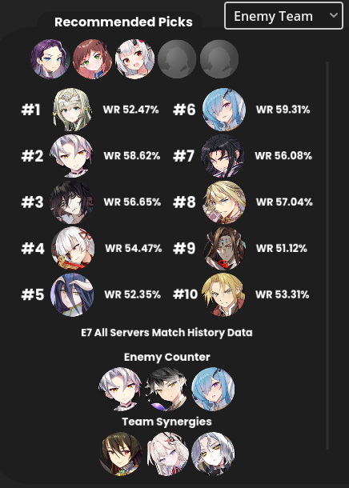

<!-- PROJECT LOGO -->
 

<h3 align="center">E7 RTA DRAFT HELPER</h3>

  

    This tool uses image recognition to detect the game screen and employs a pre-trained model to recommend the best characters for the current RTA (Real Time Arena) draft
     
    <a href="https://github.com/SamTheCoder777/E7-RTA-Helper#getting-started">Quick Start</a>
    ·
    <a href="https://github.com/SamTheCoder777/E7-RTA-Helper/issues/new?labels=bug&template=bug-report---.md">Report Bug</a>
    ·
    <a href="https://github.com/SamTheCoder777/E7-RTA-Helper/issues/new?labels=enhancement&template=feature-request---.md">Request Feature</a>
  

<!-- TABLE OF CONTENTS -->

  
Table of Contents

  <ol>
    <li>
      <a href="#about-the-project">About The Project</a>
      <ul>
        <li><a href="#built-with">Built With</a></li>
      </ul>
    </li>
    <li>
      <a href="#getting-started">Getting Started</a>
      <ul>
        <li><a href="#prerequisites">Prerequisites</a></li>
        <li><a href="#installation">Installation</a></li>
      </ul>
    </li>
    <li><a href="#initial-setup">Initial Setup</a></li>
    <li><a href="#roadmap">Roadmap</a></li>
    <li><a href="#contributing">Contributing</a></li>
    <li><a href="#license">License</a></li>
    <li><a href="#contact">Contact</a></li>
    <li><a href="#acknowledgments">Acknowledgments</a></li>
  </ol>

<!-- ABOUT THE PROJECT -->
## About The Project

I created this tool because ~~I am really bad at this game~~ even though this game is competitive, there are very limited tools/guides compared to other competitive games such as league of legends, Valorant, Dota2, etc. This tool uses SIFT algorithm to detect characters on your game screen and then uses pretrained model to predict which character would fit the best in the current draft scenario.  You can also get information on characters quickly by clicking on their portraits.

 > [!NOTE]
 > The program relies solely on publicly available information, such as the RTA game screen and Epic 7 match history, to make recommendations. It does not have information on who your opponent is, who the user is or any other game or user specific data.

(<a href="#readme-top">back to top</a>)

### Built With

* 
* 
* 
* 
* 
* 
* 

Data from:

 - [E7 Match History](https://epic7.gg.onstove.com/en)
 - [Cecilia Bot](https://ceciliabot.github.io/)

(<a href="#readme-top">back to top</a>)

<!-- GETTING STARTED -->
## Getting Started

Follow these steps to get started

### Prerequisites

**Supported OS**: **Windows** and **Mac OS M series**

### Installation

**Windows & Mac M series:** 

 1. Download the latest release from [releases](https://github.com/SamTheCoder777/E7-RTA-Helper/releases)

> [!NOTE] 
> .7z is much faster but you may need to install 7zip separately

2. Extract the files

**Windows:**

1. run `init_windows.bat`

> [!NOTE]
> The process may hang when installing python packages. This is normal behaviour. Please wait until it finishes.

**Mac**

1. Open terminal on the downloaded folder
2. `chmod +x init_mac.sh`
3. `chmod +x python_mac/install/bin/python3.11`
4. `./init_mach.sh`

> [!NOTE]
> The process may hang when installing python packages. This is normal behaviour. Please wait until it finishes.

(<a href="#readme-top">back to top</a>)

<!-- USAGE EXAMPLES -->
## Initial Setup

You will need to play a game of RTA to set up the program

 1. Launch `E7RTAHelper.exe` or `E7RTAHelper` depending on your OS

> [!IMPORTANT]
> If you are using BlueStacks or other emulators, you may need to launch E7RTAHelper as admin
> otherwise the program will not be able to detect your game

>On Mac, you may need to give permissions such as recording your screen on the security & privacy settings

 2. Click `init/settings`
 3. Click `Set Detection Screen Size`
 4. Open Epic 7 and select the game tab title from `Select Window`
 5. Then go into a RTA match
 6. After ban phase, click `screenshot`
 7. First Adjust Crop top, right, bottom and left settings then press **set** so it captures like below

8. Then set the crop center settings so it removes the center

**Your window should look like this after**

Now you are ready! 
Press `Start Detection` on the front page to get started
and make sure to set `First Pick` from the drop down menu

> [!TIP]
> Press `Esc` after drafting to switch the tool to idle mode and reduce lag

(<a href="#readme-top">back to top</a>)

## Features

 - **Display user statistics**
	 - You can set your account on `Set User Data` in the settings
	 - Your stats will now display on detection screen
	 - 
	 
- **Detect your game screen and display data**
	- Recommend top 10 characters that fits into your draft
	- 
	- Predict your win rate with your current drafts
  - 
  - Quickly get information about your enemy's pick
	- 
    - Pause detection by pressing `esc`
	
- **Get character information by clicking on character portrait**
	- Information is available thanks to [Ceciliabot](https://ceciliabot.github.io/#/)
	- 

<!-- ROADMAP -->
## Roadmap

- [ ] Display information for character's EE
- [ ] Setting for limiting characters in the recommender
- [ ] Make a settings for detection boundary so the user can lower or increase if character is not being detected properly
- [ ] Meta tracker
- [ ] Profile review page
- [ ] Auto update user stats

See the [open issues](https://github.com/SamTheCoder777/E7-RTA-Helper/issues) for a full list of proposed features (and known issues).

(<a href="#readme-top">back to top</a>)

<!-- CONTRIBUTING -->
## Contributing

Contributions are what make the open source community such an amazing place to learn, inspire, and create. Any contributions you make are **greatly appreciated**.

If you have a suggestion that would make this better, please fork the repo and create a pull request. You can also simply open an issue with the tag "enhancement".
Don't forget to give the project a star! Thanks again!

1. Download Godot version 4.2.2
2. Fork the Project
3. Clone and open the project on Godot
4. Create your Feature Branch (`git checkout -b feature/AmazingFeature`)
5. Commit your Changes (`git commit -m 'Add some AmazingFeature'`)
6. Push to the Branch (`git push origin feature/AmazingFeature`)
7. Open a Pull Request

(<a href="#readme-top">back to top</a>)

<!-- LICENSE -->
## License

Distributed under the Apache-2.0 License. See `LICENSE.txt` for more information.

(<a href="#readme-top">back to top</a>)

<!-- CONTACT -->
## Contact

For now, please open up an issue if you are having problem

(<a href="#readme-top">back to top</a>)

<!-- ACKNOWLEDGMENTS -->
## Acknowledgments

* [Ceciliabot](https://ceciliabot.github.io/#/) for letting me use their amazing website for character descriptions

(<a href="#readme-top">back to top</a>)

