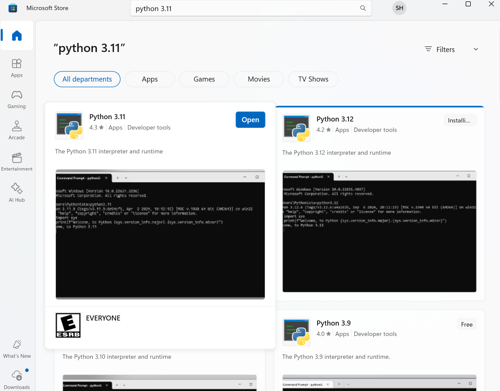
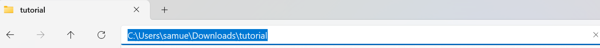
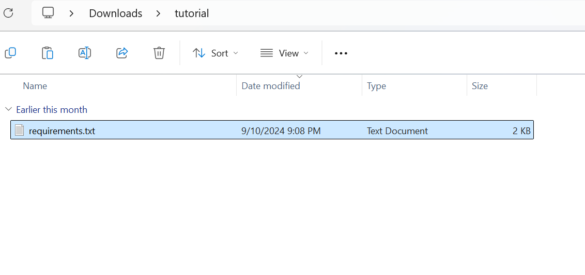
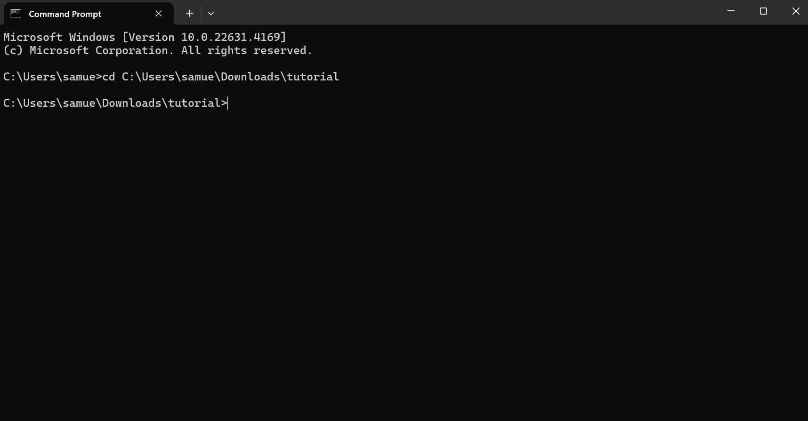
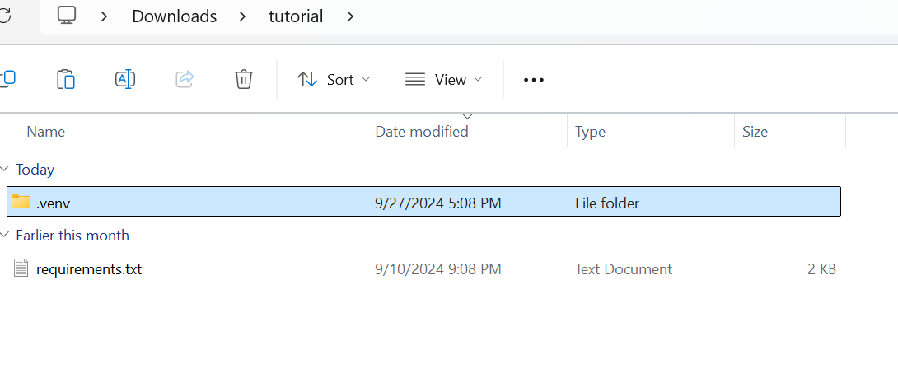
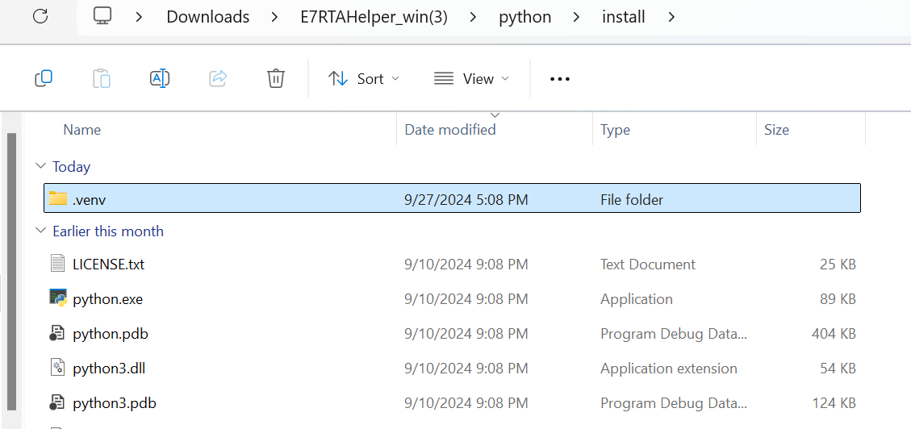

## Open Microsoft Store and search for "Python 3.11"

Hover over Python 3.11 and click "Get"
Wait until it finishes installing

## Make a new folder

> Note: Folder path doesn't matter

Copy the folder's path

## Copy the "requirements.txt" file to the folder you created

"requirements.txt" file is in the \<extracted E7RTAHelper folder>/python/install

copy this requirements.txt file to the folder you created

## Open terminal

You can open windows terminal by doing:
1. press "windows key + R"
2. Type "cmd" then enter

Or

By searching for "command prompt" in the searches

## Move to the folder you created

type "cd " paste in the folder path then enter

> cd C:\Users\samue\Downloads\tutorial

## Install required python modules

Type these commands to the terminal (type it exactly how it is. This means that you need to include quotes as well)
> python3.11 -m venv .venv

> ".venv/Scripts/activate"

> pip install -r requirements.txt

This may take a while   

## Move the ".venv" folder to E7RTAHelper

Now if you go back to the folder you created, there will be ".venv" folder newly created

Move this folder to \<extracted E7RTAHelper folder>/python/install

## Move on with initial setup
Make sure to have Git downloaded and move on with 
[initial setup](https://github.com/SamTheCoder777/E7-RTA-Helper?tab=readme-ov-file#initial-setup)
